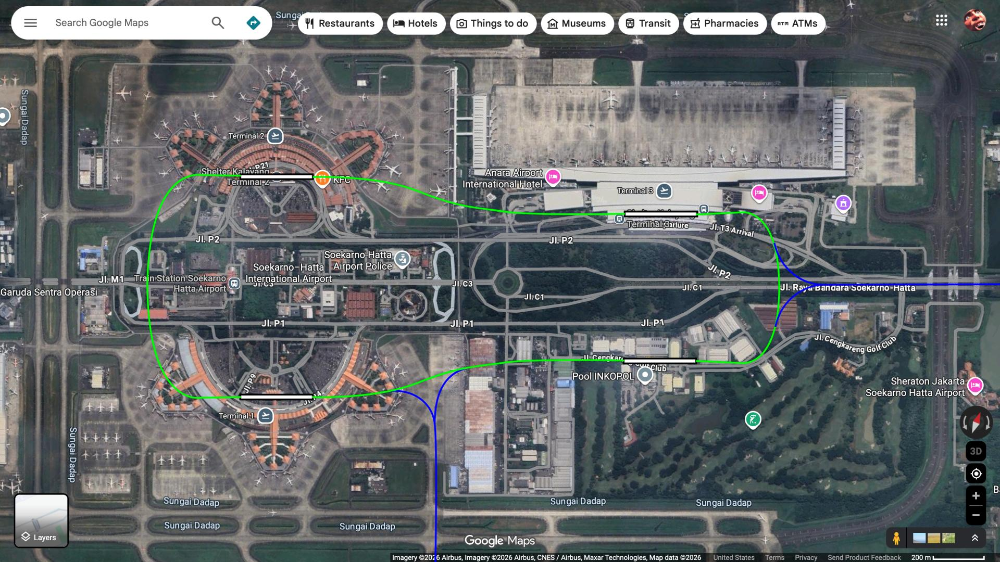

Welcome to my little corner of the internet.

This blog lives inside a fake desktop OS, because why not.

## Writing in Markdown

Posts are plain `.md` files in the `posts/` folder. To add one:

1. Create `posts/your-slug.md`
2. Add one entry to `BLOG_POSTS` in `core/config.js`

## Supported syntax

- **Bold**, *italic*, ~~strikethrough~~, `inline code`
- [Links](https://www.youtube.com/watch?v=dQw4w9WgXcQ)
- Images (see below)
- Blockquotes, headings, lists, code blocks, `---` rules

## Images

Use standard Markdown image syntax:

You can also use relative paths to images in your repo:

> "The best writing tool is the one you actually use."

---

More coming soon.